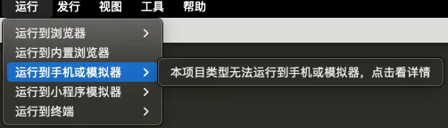
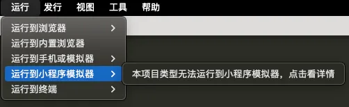
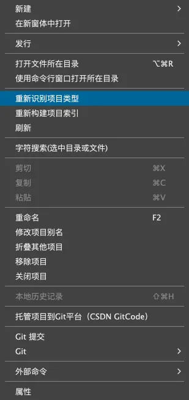

# hbx 模板

为了方便使用 `HBuilderX` 的开发者，`q-uniapp` 也提供 `hbx` 模板。

`hbx 模板` 适用于 `2 类用户`

- 使用 `uniCloud` 云开发的用户，必须使用 `hbx 版本`，因为 `uniCloud` 跟 `HBuilderX` 是绑定的。
- 开发 `App` 的用户，可选使用 `hbx 版本`。

## 仓库地址

- gitee: [https://gitee.com/uglyp/q-uniapp-hbx.git](https://gitee.com/uglyp/q-uniapp-hbx.git)
- github: [https://github.com/uglyp/q-uniapp-hbx.git](https://github.com/uglyp/q-uniapp-hbx.git)

没有梯子的用户优先推荐使用 `gitee` 仓库，速度更快。（两个仓库会实时同步，无差别。）

## 导入项目

有 2 种方式导入项目：

- 从 `Git` 导入...
- 从本地目录导入...

## 运行项目

此时运行菜单会提示 `本项目类型无法运行`，如下图

需要执行如下 2 步：

- 项目下执行 `pnpm i`
- 右键项目，选择 `重新识别项目类型`

> 目前微信小程序静态资源还有点问题，`logo 不见了`，后续会修复。
> 另外还发现 `UnoCSS Icon` 不生效，原因未知。
