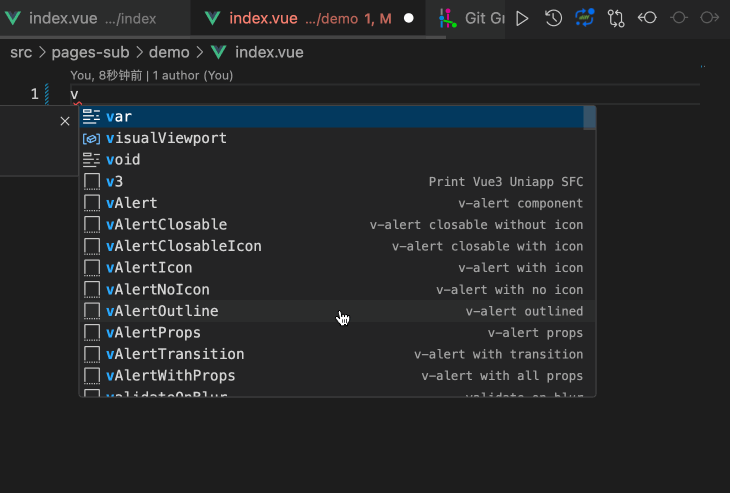

# 快速开始

- 前置依赖

  - **Node.js** - `>=v18`
  - **pnpm** - `>=7.30`（推荐使用 `8.12+`）
  - **`VSCode`** - 可选 `WebStrom`
  - **`HBuilderX`** - `APP` 的运行和发布还是离不开它
  - **Vue-Office** - `1.8x`，别升到 `2.x` ！

## 创建项目

通过下面的命令可以快速生成项目模板，`pnpm create q-uniapp <项目名称>` ，如果不写 `<项目名称>` 会进入命令行交互模式。

```bash
# 如果没有 pnpm，请先安装: npm i -g pnpm
pnpm create q-uniapp my-project
```

npm 创建如下(不推荐)
:::details
如果使用 `npm`，可能有缓存，需要加上 `@latest` 标识，如果创建失败，请使用 `pnpm` 安装。

```bash
npm create q-uniapp my-project
# 如果提示报错，或者生成的项目版本太旧，请使用下面的命令，增加 @latest 标识
npm create q-uniapp@latest my-project
```

:::
实际操作截图如下：


`create-q-uniapp` 在 `v1.10.0` 开始会有版本号

`create q-uniapp` 支持 `-t` 参数选择模板，目前已有两大类 `6` 个模板

- `普通` 模板( `4个` ）：分别是 `base`、`tabbar`、`i18n`、`demo`
- `hbx` 模板(`2个` ）：分别是 `hbx-base`、`hbx-demo`。

不带 `-t` 参数时会默认生成 `base` 模板。

`base` 模板是最基本的模板，更新最及时，推荐使用 `base` 模板创建新项目。其他几个模板也是基于 `base` 模板得到的。 `demo` 模板则作为参考用。

`js` 模板不推荐使用，可以使用 `base` 模板替代，里面已经做了兼容配置，可以直接编写 `js`，原本的 `ts` 文件还能提供部分类型，何乐而不为？

```sh
# VS Code 模板
pnpm create q-uniapp my-project # 默认用 base 模板

pnpm create q-uniapp my-project -t base # 基础模板
pnpm create q-uniapp my-project -t tabbar # 自定义 tabbar 模板
pnpm create q-uniapp my-project -t i18n # 多语言模板
pnpm create q-uniapp my-project -t demo # 所有demo的模板(包括i18n)

# HBuilderX 模板，方便使用 uniCloud 云开发 (未来可以对接 uni-app x)
pnpm create q-uniapp my-project -t hbx-base # hbx的base模板
pnpm create q-uniapp my-project -t hbx-demo # hbx的demo模板，包含所有的demo
```

## 项目仓库地址

`github` 和 `gitee` 实时同步，代码一致。

### 普通模板：

- https://github.com/uglyp/q-uniapp
- https://gitee.com/uglyp/q-uniapp

> `demo` 模板是在 `q-uniapp` 项目中，仓库地址如下：

- https://github.com/uglyp/q-uniapp-demo
- https://gitee.com/uglyp/q-uniapp-demo

### hbx 模板

- https://github.com/uglyp/q-uniapp-hbx
- https://gitee.com/uglyp/q-uniapp-hbx

## 安装、运行

```bash [pnpm]
pnpm i
pnpm dev
# dev默认运行的是h5，其他平台执行dev:<uni-platform>，如:
pnpm dev:mp-weixin
```

`pnpm dev` 之后在浏览器打开 `http://localhost:9000/`。

> 其他平台构建和发布，查看 [运行发布篇](./11-build)。

## 第一次 `commit`

```bash
git add .
git commit -m "feat: init project"
```

c

在 `vue` 文件中，输入 `v3` 按 `tab` 即可快速生成页面模板，可以大大加快页面生成。

> 原理：基于 `VSCode` 代码块生成。



## 注意事项

- 若代码里面自动引入的 `API` 报错，只需要 `pnpm dev` 即可。
- 若代码运行后，`H5端` 浏览器界面底部没有 `tabbar`， 刷新浏览器或者再次 `pnpm dev` 即可。
